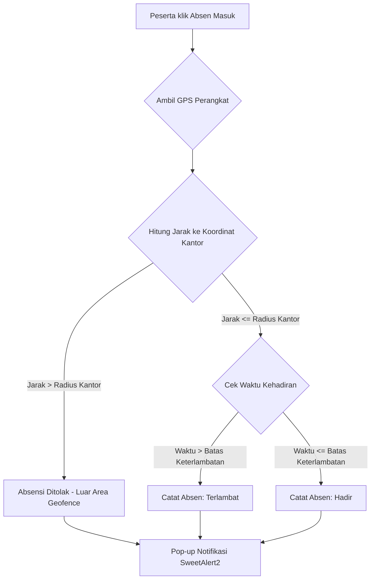

# 📱 AbsenDJJ - Sistem Manajemen Absensi Geofencing & Magang Terpadu

<p align="center">
  
  <br><br>
  
  
  
  
  
</p>

---

## 🌟 Tentang AbsenDJJ

**AbsenDJJ** adalah platform berbasis web modern dan premium untuk pencatatan kehadiran (absensi) bagi para peserta magang atau Praktik Kerja Lapangan (PKL) secara presisi. Dilengkapi dengan batasan area masuk (**Geofencing**), pengawasan berbasis pembimbing lapangan (Admin), serta kendali parameter global dan statistik visual interaktif oleh **Super Admin**.

Aplikasi dirancang dengan antarmuka premium yang sangat responsif (dioptimalkan penuh untuk handphone Safari iPhone 12), mendukung **Light Mode & Dark Mode** secara instan, pemantauan status jaringan lambat secara otomatis, serta pemisahan kode modular (*Clean Architecture*) antara JavaScript, CSS, dan PHP Blade view.

---

## 📐 Alur Kerja Absensi Geofencing



---

## 🛠️ Fitur Unggulan Aplikasi

### 👑 1. Panel Super Admin
* **ApexCharts Stacked Chart**: Grafik stacked column harian yang memvisualisasikan tren kehadiran peserta magang (Hadir, Terlambat, Izin, Absen) secara kronologis dalam 7 hari kerja terakhir.
* **Smart Theme Synchronization**: Otomatis menyelaraskan warna teks, sumbu diagram, gridlines, legenda, dan tooltip ApexCharts saat berganti antara tema terang dan gelap secara real-time via `MutationObserver`.
* **Visual Map Geofencing**: Penandaan titik koordinat latitude & longitude kantor secara langsung di peta interaktif **Leaflet.js** (tidak perlu input angka koordinat manual).
* **Radius Geofence Dinamis**: Lingkaran hijau di peta membesar/mengecil secara instan saat kolom radius diubah.
* **Geocoding Search**: Cari nama lokasi atau alamat kantor secara instan menggunakan pencarian terintegrasi API **Nominatim OpenStreetMap**.
* **Navigator GPS**: Tombol GPS untuk mendeteksi posisi koordinat perangkat pengguna secara langsung melalui HTML5 Geolocation.
* **Waktu Kehadiran Dinamis**: Pengaturan Jam Masuk, Jam Pulang, dan Batas Keterlambatan yang divalidasi secara dinamis saat peserta melakukan absensi.
* **Master Data Terpusat**: Pengelolaan instansi (sekolah/universitas/dinas) dengan validasi relasional yang mencegah penghapusan jika instansi masih memiliki anggota aktif.

### 👥 2. Panel Admin (Pembimbing Lapangan)
* **Persetujuan Logbook Harian**: Tinjau aktivitas harian anak bimbingan secara instan dengan modal peninjauan interaktif.
* **Persetujuan Izin/Sakit**: Manajemen permohonan ketidakhadiran peserta secara terstruktur.
* **Profil Aktivitas Detail**: Rekap statistik kehadiran kumulatif peserta, status keterlambatan, visual kalender kehadiran bulanan, serta pengunduhan rekap laporan (PDF/CSV).
* **Floating Action Button (FAB)**: Pintasan melayang di pojok kanan bawah yang memudahkan akses cepat untuk menyetujui logbook atau permohonan izin dari perangkat ponsel.

### 🎓 3. Panel Peserta (Interns)
* **Sistem Absensi Geofencing & Selfie**: Melakukan absen masuk dan pulang dengan melampirkan foto selfie secara real-time.
* **Logbook Harian**: Mengisi aktivitas harian beserta tag topik bahasan dan menyimpan draf sebelum dikirim ke pembimbing.
* **Pengajuan Izin/Sakit**: Mengajukan izin ketidakhadiran dengan melampirkan dokumen bukti (surat dokter/lampiran) hingga batas ukuran **10MB**.
* **Riwayat Absensi Visual**: Kalender kehadiran interaktif yang menampilkan status dan jam kehadiran harian secara rapi.

---

## 📱 Optimalisasi Mobile & Jaringan

* **Pemantau Jaringan Lambat (Network Interceptors)**:
  * Menggunakan pembungkus global pada `window.fetch` untuk mendeteksi koneksi lambat. Jika transaksi pengiriman data (`POST`, `PUT`, `DELETE`) memakan waktu lebih dari `500ms`, popup SweetAlert2 **"Menghubungkan..."** akan muncul secara otomatis.
  * Navigasi internal tautan (`a`) dan pengiriman form (`submit`) memicu tampilan loading indikator instan guna mencegah klik ganda dan memberikan umpan balik visual yang responsif.
* **Pencegahan Clipped Layout (iPhone 12 Safari)**:
  * Batasan global `.content-card { overflow: hidden; min-width: 0; }` mencegah pembesaran boks kartu akibat luapan data tabel atau visual kalender.
  * Kalender visual kehadiran pada halaman detail pembimbing dan riwayat peserta menggunakan pembungkus scrollable horizontal `.calendar-wrapper { overflow-x: auto; }` dengan batas minimum lebar `.calendar-grid` sebesar `600px` untuk menjaga keterbacaan data tanggal di layar sempit.
  * Penyesuaian pointer-events (`pointer-events: none` pada kontainer FAB utama dan `pointer-events: auto` pada tombol anak) memastikan tombol-tombol di baris terbawah tabel tetap dapat diklik secara normal tanpa terhalang area transparan FAB.
* **Live Refresh State Check**:
  * Aplikasi memiliki fungsi auto-refresh cerdas untuk menyelaraskan perubahan data secara real-time tanpa perlu memaksa pengguna menekan tombol muat ulang secara manual.

---

## 📂 Struktur Aset Khusus (Modular Refactoring)

Untuk mematuhi prinsip modularitas, seluruh kode CSS (`<style>`) dan JS (`<script>`) yang sebelumnya menyatu di dalam berkas Blade telah diekstraksi ke berkas terpisah di bawah direktori `resources/css` dan `resources/js`, menggunakan nama berkas yang selaras dengan nama file Bladenya:

```text
resources/
├── css/
│   ├── auth-login.css           # Styling halaman masuk
│   ├── dashboard-layout.css     # Styling cangkang tata letak dashboard global
│   ├── app.css                  # Base styles & variables
│   ├── show.css                 # [NEW] Styling detail profil & hover foto selfie
│   ├── leave.css                # [NEW] Styling form filter & perizinan peserta
│   ├── logbook.css              # [NEW] Styling manajemen logbook & badge draf
│   └── super_admin/             # Folder aset CSS Super Admin per fitur
│       ├── dashboard.css
│       ├── instansi.css
│       ├── pembimbing.css
│       ├── peserta.css
│       └── settings.css
└── js/
    ├── auth-login.js            # Interaksi halaman masuk & penanganan error Swal
    ├── dashboard-layout.js      # Kontrol sidebar, tema gelap/terang, & global loading
    ├── show.js                  # [NEW] Kontrol modal pratinjau selfie harian
    ├── leave.js                 # [NEW] Kontrol modal formulir izin peserta
    ├── logbook.js               # [NEW] Konfirmasi hapus logbook & modal edit
    └── super_admin/             # Folder aset JS Super Admin per fitur
        ├── dashboard.js
        ├── instansi.js
        ├── pembimbing.js
        ├── peserta.js
        └── settings.js          # Pembaca data config terenkapsulasi via data-attributes
```

---

## 📐 Arsitektur Controller Terpisah (Admin)

Logika pemrograman di sisi Admin telah dipisah ke dalam controller yang berdedikasi per fitur/halaman untuk mencegah penumpukan fungsi dalam satu kelas:

* **`DashboardController.php`**: Hanya mengelola visualisasi ringkasan statistik kehadiran hari ini dan kepatuhan peserta magang.
* **`InternController.php`**: Berfokus melayani data daftar peserta magang bimbingan (`index`) dan profil aktivitas harian terperinci peserta (`show`).
* **`LogbookController.php` [NEW]**: Khusus menangani pengelolaan daftar logbook anak bimbingan serta proses persetujuan (`approve`) dan penolakan (`reject`).
* **`LeaveController.php` [NEW]**: Khusus menangani pengelolaan daftar permohonan izin/sakit anak bimbingan serta proses persetujuan (`approve`) dan penolakan (`reject`).

---

## 💻 Spesifikasi Teknologi

* **Backend Framework**: Laravel 11.x (PHP 8.2+)
* **Frontend Bundler**: Vite 8.x
* **Database Driver**: MySQL / MariaDB
* **State & Configuration**: `spatie/laravel-settings` (Penyimpanan parameter dinamis berbasis database)
* **Aset Eksternal (CDN)**:
  * **Leaflet.js v1.9.4** (Peta Geofencing)
  * **ApexCharts v3.35** (Visualisasi Dashboard)
  * **SweetAlert2** (Notifikasi Interaktif)

---

## 🚀 Panduan Instalasi & Pengembangan

### 1. Kloning Repositori
```bash
git clone https://github.com/adikamh/AbsenDJJ.git
cd AbsenDJJ
```

### 2. Pasang Dependensi Composer & NPM
```bash
composer install
npm install
```

### 3. Konfigurasi Environment (`.env`)
Salin berkas `.env.example` ke `.env` dan sesuaikan kredensial basis data Anda:
```bash
cp .env.example .env
php artisan key:generate
```

### 4. Jalankan Migrasi & Seeder Database
Inisialisasi tabel, parameter default settings, dan pengguna bawaan (Super Admin, Pembimbing, Peserta):
```bash
php artisan migrate --seed
```

### 5. Jalankan Server Lokal & Pembundel Aset
Jalankan server pengembangan Laravel Artisan serta bundler Vite secara bersamaan:
```bash
# Terminal 1: Server Laravel
php artisan serve

# Terminal 2: Bundler Vite (Hot Reload)
npm run dev
```

### 6. Kompilasi Aset Produksi
Untuk melakukan build seluruh aset CSS & JS yang telah modular agar siap disajikan di server hosting/produksi:
```bash
npm run build
```

### 7. Menjalankan Tes Otomatis
Validasi kebenaran seluruh fitur pengaturan, CRUD, dan batasan hak akses melalui unit testing PHPUnit:
```bash
php artisan test
```

---

## 🔒 Lisensi

Aplikasi ini dilisensikan di bawah lisensi [MIT License](LICENSE).
