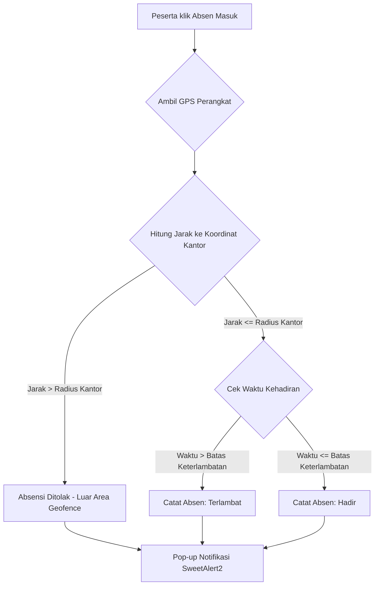

# 📱 AbsenDJJ - Sistem Manajemen Absensi Geofencing & Magang Terpadu

<p align="center">
  
  <br><br>
  
  
  
  
  
</p>

---

## 🌟 Tentang AbsenDJJ

**AbsenDJJ** adalah platform berbasis web modern untuk pencatatan kehadiran (absensi) bagi para peserta magang atau Praktik Kerja Lapangan (PKL) secara presisi. Dilengkapi dengan batasan area masuk (**Geofencing**), pengawasan berbasis pembimbing (Admin), serta kendali parameter global dan statistik visual interaktif oleh **Super Admin**.

Aplikasi dirancang dengan antarmuka yang sangat responsif, mendukung **Light Mode & Dark Mode** secara instan, serta pemisahan kode modular (Clean Architecture) antara JavaScript, CSS, dan PHP Blade view.

---

## 🛠️ Fitur Utama Aplikasi

### 👑 1. Dashboard Super Admin (Analisis Historis)
* **ApexCharts Stacked Chart**: Grafikstacked column harian yang memvisualisasikan data kehadiran peserta magang (Hadir, Terlambat, Izin, Absen) secara kronologis dalam 7 hari kerja terakhir.
* **Smart Theme Synchronization**: Otomatis menyelaraskan warna teks, sumbu diagram, gridlines, legenda, dan tooltip ApexCharts saat berganti antara tema terang dan gelap secara real-time via `MutationObserver`.

### 🎛️ 2. Parameter Global & Geofencing Pintar
* **Visual Map Geofencing**: Penandaan titik koordinat latitude & longitude kantor secara langsung di peta interaktif **Leaflet.js** (tidak perlu input angka koordinat manual).
* **Radius Geofence Dinamis**: Lingkaran hijau di peta membesar/mengecil secara instan saat kolom radius diubah.
* **Geocoding Search**: Cari nama lokasi atau alamat kantor secara instan menggunakan pencarian terintegrasi API **Nominatim OpenStreetMap**.
* **Navigator GPS**: Tombol GPS untuk mendeteksi posisi koordinat perangkat pengguna secara langsung melalui HTML5 Geolocation.
* **Waktu Kehadiran Dinamis**: Pengaturan Jam Masuk, Jam Pulang, dan Batas Keterlambatan yang divalidasi secara dinamis saat peserta melakukan absensi.

### 🏢 3. Kelola Master Data Terpusat
* **Kelola Instansi**: Pengelolaan data sekolah, universitas, atau dinas peserta magang lengkap dengan validasi relasional (mencegah penghapusan jika instansi masih memiliki anggota).
* **Kelola Peserta & Pembimbing**: CRUD lengkap, reset password, dan detail profil lengkap (bebas dari pemaparan data sensitif password).

### 🔍 4. UI/UX Premium & Kontras Maksimal
* **Searchable Dropdown & Autocomplete**: Pilihan pembimbing dan autocomplete instansi yang ramah pencarian.
* **Warna Sesuai Tema**: Warna dropdown kustom dan elemen select/option otomatis menyesuaikan warna latar belakang terang/gelap demi kenyamanan mata.
* **Filter Terpadu & Pagination**: Satu modal filter gabungan dengan penanda tombol aktif dan pagination client-side (maksimal 5 data per halaman).
* **Custom SweetAlert2**: Dialog peringatan kustom yang serasi dengan tema gelap/terang.

---

## 📐 Alur Kerja Absensi Geofencing



---

## 💻 Tech Stack & Ketergantungan

* **Backend**: Laravel 11.x (PHP 8.2+)
* **Frontend**: HTML5, Vanilla CSS, Vanilla ES6 JavaScript (dihubungkan via Laravel Vite)
* **State & Configuration**: `spatie/laravel-settings` (Penyimpanan parameter dinamis berbasis database)
* **Libraries (via CDN / Bundle)**:
  * **Leaflet.js v1.9.4** (Peta Geofencing)
  * **ApexCharts v3.35** (Visualisasi Dashboard)
  * **SweetAlert2** (Notifikasi Interaktif)

---

## 🚀 Panduan Instalasi & Pengembangan

### 1. Kloning Repositori
```bash
git clone https://github.com/adikamh/AbsenDJJ.git
cd AbsenDJJ
```

### 2. Pasang Dependensi Composer & NPM
```bash
composer install
npm install
```

### 3. Konfigurasi Environment (`.env`)
Salin berkas `.env.example` ke `.env` dan sesuaikan kredensial basis data Anda:
```bash
cp .env.example .env
php artisan key:generate
```

### 4. Jalankan Migrasi & Seeder Database
Inisialisasi tabel, parameter default settings, dan pengguna bawaan (Super Admin, Pembimbing, Peserta):
```bash
php artisan migrate --seed
```

### 5. Kompilasi Aset & Jalankan Server Lokal
Jalankan server pengembangan Laravel Artisan serta bundler Vite secara bersamaan:
```bash
# Terminal 1: Server Laravel
php artisan serve

# Terminal 2: Bundler Vite
npm run dev
```

### 6. Menjalankan Tes Otomatis
Validasi kebenaran fitur pengaturan, CRUD, dan batasan hak akses melalui unit testing PHPUnit:
```bash
php artisan test
```

---

## 📂 Struktur Aset Khusus (Super Admin)

Untuk mematuhi modularitas kode, aset JavaScript dan CSS untuk halaman Super Admin dipisahkan ke dalam berkas-berkas tersendiri:
```text
resources/
├── css/
│   ├── super_admin_peserta.css
│   ├── super_admin_pembimbing.css
│   ├── super_admin_instansi.css
│   └── super_admin_settings.css
└── js/
    ├── super_admin_peserta.js
    ├── super_admin_pembimbing.js
    ├── super_admin_instansi.js
    └── dashboard-super-admin.js (ApexCharts handler)
```

---

## 🔒 Lisensi

Aplikasi ini dilisensikan di bawah lisensi [MIT License](LICENSE).
